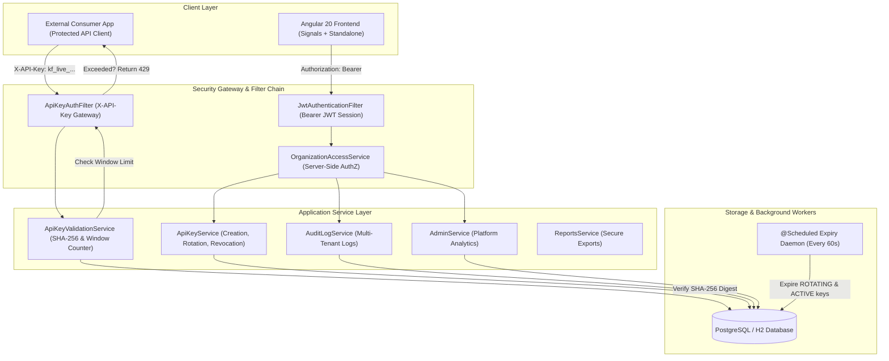
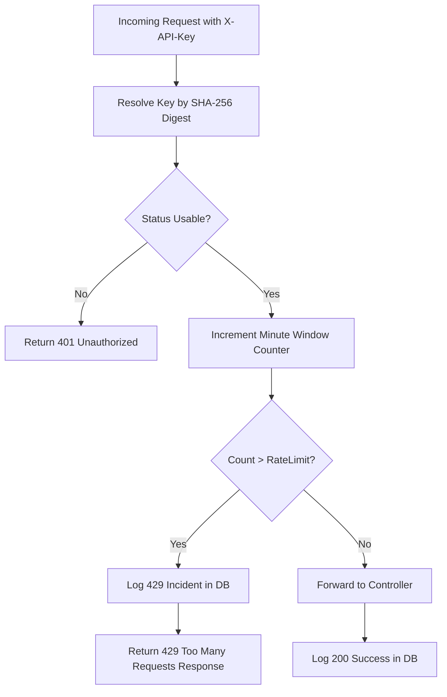
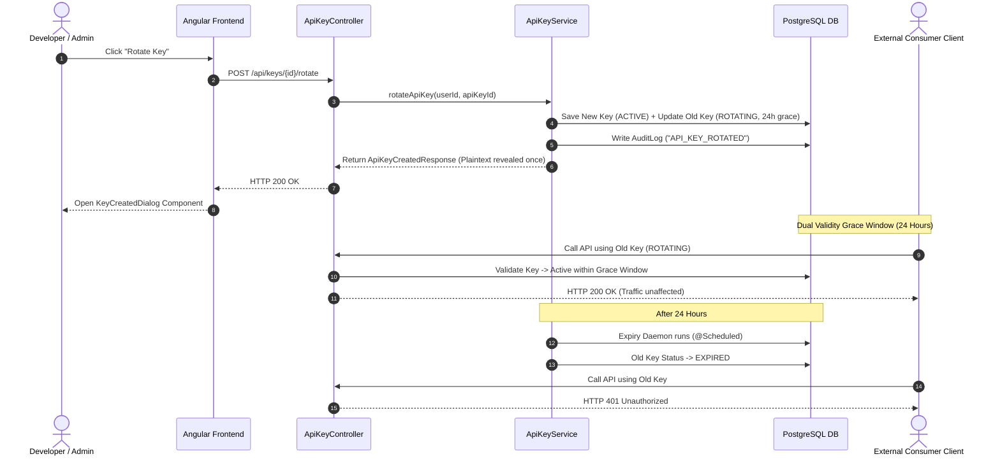

# 🏆 KeyForge — Hackathon Master Solution & Judge Guide

> **Project Name**: KeyForge — Developer API Key & Access Management Platform  
> **Repository**: [devloperYash/Api-Key-Management-System](https://github.com/devloperYash/Api-Key-Management-System)  
> **Tech Stack**: Java 21, Spring Boot 3.3.4, Spring Security, Spring Data JPA, PostgreSQL / H2, Angular 20, Angular Material, RxJS, Angular Signals, Google Gemini AI (Forge Assistant)
> **Status**: 100% Core Features Complete | Production Grade Architecture | AI Integrated | Easy-to-Follow Documentation

---

## 🚀 1. Project Overview & Problem Statement

### 📌 What is KeyForge?
KeyForge is an enterprise developer platform designed to create, manage, scope, rotate, revoke, and monitor API keys — exactly like **Stripe Dashboard > Developers > API Keys**, **Razorpay**, **AWS API Gateway**, or **OpenAI Developer Portal**.

When modern companies expose public APIs to third-party developers, they need a secure dashboard to:
1. 🔑 **Generate Scoped API Keys**: Restrict key access to specific permissions (`READ_USERS`, `WRITE_BILLING`, etc.).
2. 🛡️ **Zero-Trust Hashing**: Store only SHA-256 digests in the database, showing raw keys **only once** at creation time.
3. 🚦 **Enforce Rate Limits**: Prevent server overload by setting per-minute request limits.
4. 🔄 **Zero-Downtime Key Rotation**: Replace old keys safely using a 24-hour grace period so active apps don't break.
5. ❌ **Instant Revocation**: Soft-delete compromised keys instantly across all systems.
6. 📜 **Audit Logs & Analytics**: Track who created, rotated, or revoked keys and monitor real-time API call metrics.
7. 🤖 **AI-Powered Insights (Forge Assistant)**: Smart security recommendations and automated scope generation using Google Gemini AI.

---

## 📊 2. Project Status: Initial State vs. Our Completed Work

Here is a clear, simple comparison of what was given in the initial codebase versus what we fixed and built:

### 🔄 Before vs. After Comparison Table

| Feature / Area | What Was Given Initially (Baseline) | What Was Broken or Missing | What We Did (Our Solution & Final Status) |
|---|---|---|---|
| 🔄 **API Key Rotation** | Endpoint returned `501 Not Implemented`. Frontend showed "Coming Soon". | Old keys could not be rotated safely without breaking client apps. | Fully implemented zero-downtime key rotation. Generates a new `ACTIVE` key, marks old key as `ROTATING` with a 24-hour grace period, and auto-expires it using a background scheduled task. |
| 🚦 **Rate Limiting Enforcement** | `ApiKeyAuthFilter` counted API requests. | When request limit was crossed, filter allowed requests anyway! | Fixed filter to return HTTP `429 Too Many Requests` when limit is exceeded, while logging rejected calls into usage analytics. |
| 🔒 **IDOR Security Fix** | Keys could be fetched or revoked directly by ID. | Any logged-in user could guess key UUIDs and delete/read other orgs' keys. | Added `accessService.requireMembership()` checks on backend to verify caller owns the key's organization. |
| 🔑 **SHA-256 Key Verification** | Verification checked hash ONLY if multiple keys shared a prefix. | Single prefix match bypassed SHA-256 verification. | Removed prefix shortcut. Enforced full SHA-256 hash comparison on every API call. |
| 📜 **Audit Logging System** | Database saved audit logs, but no read API or frontend UI. | Users couldn't see history of key creations, rotations, or revocations. | Built backend DTOs, Service, and REST endpoint (`/api/organizations/{orgId}/audit-logs`), and created Angular Material Audit Log page with colored chips. |
| 📊 **Platform Admin Analytics** | Endpoint `platformUsageSummary()` returned `501 Not Implemented`. | Admins couldn't see total platform usage across organizations. | Built `AdminService` cross-org analytics aggregating total calls, active keys, error rates, and top organizations. |
| ☑️ **Scope Checkbox Sync** | Checkboxes used two separate state variables. | Desynchronized state, empty scope submissions, wrong JSON payloads. | Rebuilt form using Angular Reactive `FormArray` + custom validator `atLeastOneScopeSelectedValidator`. |
| 🛡️ **Frontend Permission Directives** | `HasPermissionDirective` file path was missing. | Action buttons caused Angular compilation errors or failed to render. | Created `HasPermissionDirective` (`*kfHasPermission`) to dynamically hide/show buttons based on org member roles. |
| ⚡ **Database Performance (N+1 Queries)** | Dashboard stats ran nested loops per project & key. | Fired $N+1$ database queries on every dashboard load. | Replaced loops with optimized single-query JPQL aggregations and added `@EntityGraph` eager joins. |
| 🤖 **AI Integration (Forge Assistant)** | None. | Manual scope selection & basic analytics. | Built `ForgeAssistantService` (Gemini API) to provide real-time Smart Security Insights on the dashboard and AI-driven optimal scope recommendations during key creation. |

---

## 🏛️ 3. High-Level System Architecture



---

## 🔴 4. Detailed Breakdown of Critical Bugs & Our Approach

Here is a simple, detailed explanation of every critical bug found in the codebase, why it was dangerous, and our exact approach to fixing it:

---

### 🚦 Bug 1: Rate Limit Bypass (Known Bug #4)

- **What Was Wrong?**  
  `ApiKeyAuthFilter` called `recordRequestAndCheckLimit()`, which returned `false` when a key exceeded its request limit. However, the filter ignored `false` and still allowed the request to go through to the controller!

- **Why Was It Critical?**  
  Attackers could make thousands of requests per minute, bypassing rate limits completely and crashing backend servers (DoS vulnerability).

- **Our Approach & Fix**:  
  We modified `ApiKeyAuthFilter.java` so that when `recordRequestAndCheckLimit()` returns `false`, the filter immediately short-circuits the request and returns an HTTP `429 Too Many Requests` JSON response. We also logged rate-limited requests so they appear accurately in usage analytics.



---

### 🔒 Bug 2: IDOR Vulnerabilities in API Key Operations

- **What Was Wrong?**  
  `getApiKey()` and `revokeApiKey()` in `ApiKeyService.java` fetched keys by ID directly without checking if the logged-in user belonged to the organization that owned that key.

- **Why Was It Critical?**  
  Any authenticated user could read or delete another organization's API keys simply by changing the UUID in the API URL (Insecure Direct Object Reference).

- **Our Approach & Fix**:  
  We injected `accessService.requireMembership(userId, organizationId)` inside `getApiKey()` and `revokeApiKey()`. Now, the backend verifies server-side that the caller belongs to the key's organization before performing any action.

---

### 🔑 Bug 3: Key Hash Verification Bypass

- **What Was Wrong?**  
  `ApiKeyValidationService` had a shortcut: if `findAllByKeyPrefix()` returned only 1 matching key prefix, it skipped full SHA-256 hash verification!

- **Why Was It Critical?**  
  An attacker who guessed a 16-character prefix could authenticate without knowing the secret plaintext key.

- **Our Approach & Fix**:  
  We completely removed the shortcut. Every incoming key must now undergo full cryptographic hash comparison (`apiKeyGenerator.matches(presentedKey, k.getHashedKey())`) before being authenticated.

---

### ☑️ Bug 4: Scope Checkbox Data Loss (Known Bug #6)

- **What Was Wrong?**  
  In `CreateApiKeyDialogComponent`, selected permission scopes were stored in two separate variables. When opening/closing the dialog or submitting, selected scopes drifted out of sync, causing empty scope submissions or wrong JSON payloads.

- **Why Was It Critical?**  
  Generated API keys lost their assigned permissions or ended up with corrupted scopes in the database.

- **Our Approach & Fix**:  
  We rebuilt the dialog form using Angular **Reactive FormArray** and added a custom validator `atLeastOneScopeSelectedValidator`. Now, checkbox selections in the UI are perfectly synchronized with the form value and sent correctly to the backend.

---

### 📤 Bug 5: Unauthenticated Reports Export Endpoint

- **What Was Wrong?**  
  The endpoint `GET /api/reports/projects/{projectId}/keys/export` allowed anyone to download CSV dumps of API keys without sending an authentication token.

- **Why Was It Critical?**  
  Unauthenticated data leakage of sensitive project key metadata.

- **Our Approach & Fix**:  
  Added `@CurrentUserProvider` validation and `accessService.requireMembership()` checks to `ReportsController.java` to ensure only authorized organization members can export reports.

---

### 📊 Bug 6: Analytics UI Loading Spinner Glitch

- **What Was Wrong?**  
  On `AnalyticsComponent`, the loading spinner never hid after data was fetched successfully.

- **Why Was It Critical?**  
  Created a poor user experience, making the analytics page look broken or frozen.

- **Our Approach & Fix**:  
  Added `this.loading.set(false)` inside the RxJS `next` subscriber block so the spinner hides immediately when data arrives.

---

## 🟡 5. Missing Features Implemented & Our Approach

---

### 🔄 Feature 1: Zero-Downtime API Key Rotation

- **What Was Missing?**  
  The backend endpoint `POST /api/keys/{id}/rotate` returned `501 Not Implemented`. In the frontend, clicking "Rotate Key" showed a "Coming Soon" toast.

- **Our Approach & Fix**:  
  1. **Backend Implementation (`ApiKeyService.rotateApiKey()`)**:
     - Generates a new `ACTIVE` key with identical project, scopes, and rate limits.
     - Sets the old key's status to `ROTATING` and assigns a **24-hour grace period** (`gracePeriodEndsAt = Instant.now().plus(24, ChronoUnit.HOURS)`).
     - Updates `ApiKeyValidationService.isUsable()` so `ROTATING` keys remain valid during their grace period.
     - Added an `@Scheduled(fixedRate = 60000)` background worker to auto-expire rotating keys once 24 hours have passed.
     - Saves an audit log event (`API_KEY_ROTATED`).
  2. **Frontend Implementation (`ApiKeyListComponent`)**:
     - Built a confirmation dialog that calls `ApiKeyService.rotate()`.
     - Opens `KeyCreatedDialogComponent` to reveal the new plaintext secret **once**.
     - Displays amber `ROTATING` status chips for old keys during their grace period.



---

### 📜 Feature 2: Organization Audit Logs System

- **What Was Missing?**  
  The backend wrote audit records to the database during key creation/revocation, but there was no API to fetch audit logs, and the frontend audit page was an empty shell.

- **Our Approach & Fix**:  
  1. **Backend**: Created `AuditLogResponse` DTO, `AuditLogService`, `AuditLogRepository`, and `AuditLogController` (`GET /api/organizations/{orgId}/audit-logs?page=0&size=20`).
  2. **Frontend**: Built `AuditLogComponent` using Angular Material Table, pagination, and color-coded status chips:
     - 🟢 `API_KEY_CREATED` (Green Chip)
     - 🟡 `API_KEY_ROTATED` (Amber Chip)
     - 🔴 `API_KEY_REVOKED` (Red Chip)

---

### 📈 Feature 3: Platform Admin Analytics (`platformUsageSummary`)

- **What Was Missing?**  
  `AdminController.platformUsageSummary()` returned `501 Not Implemented`.

- **Our Approach & Fix**:  
  Implemented `AdminService.getPlatformUsageSummary()` to aggregate metrics across all organizations on the platform:
  - Total Organizations
  - Total Projects
  - Active API Keys
  - Total API Calls Today
  - Overall Error Rate
  - Top 5 Organizations by API Usage

---

### 🛡️ Feature 4: Structural Permission Directive (`*kfHasPermission`)

- **What Was Missing?**  
  `api-key-list.component.ts` imported `HasPermissionDirective` from a non-existent file path, breaking Angular compilation on key action buttons.

- **Our Approach & Fix**:  
  Created `HasPermissionDirective` (`src/app/core/auth/has-permission.directive.ts`). It dynamically checks the user's role (`OWNER`, `ADMIN`, `MEMBER`) in the current organization and conditionally renders buttons (`Create Key`, `Rotate Key`, `Revoke Key`, `Analytics`).

---

### 🤖 Feature 5: Forge Assistant (Google Gemini AI Integration)

- **What Was Missing?**  
  The dashboard only displayed raw numbers, and creating API keys required developers to guess the best scopes and rate limits.

- **Our Approach & Fix**:  
  Integrated Google Gemini AI (branded as **Forge Assistant**) to provide intelligent features:
  1. **Smart Security & Gateway Insights**: Added `AiInsightsCardComponent` to the Dashboard. It sends real-time usage stats to the AI to generate executive summaries, security recommendations, and traffic assessments.
  2. **AI Scope Recommendations**: Added an "Ask Forge Assistant" button in the Create API Key dialog. It analyzes the key's name (e.g., "Mobile Client", "Billing System") and automatically recommends the principle of least privilege scopes and rate limits.

---

## 🟢 6. Performance Optimizations

### ⚡ 1. Fixed N+1 Query Problem in Dashboard Stats
- **Issue**: `UsageAnalyticsService` ran nested loops querying usage logs per project and key, firing $N+1$ database queries on every dashboard refresh.
- **Fix**: Replaced loops with optimized single-query JPQL aggregations in `ApiKeyUsageLogRepository` (`countTotalCallsForOrganizationBetween`, `countErrorCallsForOrganizationBetween`, `findDailyBreakdownForOrganization`).

### 🚀 2. Added `@EntityGraph` to `ApiKeyRepository`
- **Issue**: Listing API keys fired an extra `SELECT` per row to fetch lazy-loaded `Project` names.
- **Fix**: Annotated `findAllByProjectId()` with `@EntityGraph(attributePaths = {"project"})` to perform an eager `LEFT JOIN` in a single query.

---

## 📖 7. Comprehensive API Reference Guide

### 1. Create API Key
- **Endpoint**: `POST /api/organizations/{orgId}/projects/{projectId}/keys`
- **Headers**: `Authorization: Bearer <JWT>`
- **Request Body**:
  ```json
  {
    "name": "Production Payment Key",
    "scopes": ["READ_USERS", "WRITE_BILLING"],
    "rateLimitPerMinute": 100,
    "expiresAt": "2026-12-31T23:59:59Z"
  }
  ```
- **Response** (`201 Created`):
  ```json
  {
    "apiKey": {
      "id": "key_7f8a9b",
      "name": "Production Payment Key",
      "keyPrefix": "kf_live_7f8a",
      "scopes": ["READ_USERS", "WRITE_BILLING"],
      "status": "ACTIVE",
      "rateLimitPerMinute": 100
    },
    "fullKey": "kf_live_7f8a9b0c1d2e3f4g5h6i7j8k9l0m"
  }
  ```

### 2. Rotate API Key
- **Endpoint**: `POST /api/keys/{apiKeyId}/rotate`
- **Headers**: `Authorization: Bearer <JWT>`
- **Response** (`200 OK`):
  ```json
  {
    "apiKey": {
      "id": "key_new_123",
      "name": "Production Payment Key (Rotated)",
      "keyPrefix": "kf_live_9z8y",
      "status": "ACTIVE"
    },
    "fullKey": "kf_live_9z8y7x6w5v4u3t2s1r0q"
  }
  ```

### 3. Revoke API Key
- **Endpoint**: `POST /api/keys/{apiKeyId}/revoke`
- **Headers**: `Authorization: Bearer <JWT>`
- **Response**: `204 No Content`

### 4. Fetch Audit Logs
- **Endpoint**: `GET /api/organizations/{orgId}/audit-logs?page=0&size=20`
- **Headers**: `Authorization: Bearer <JWT>`
- **Response** (`200 OK`):
  ```json
  {
    "content": [
      {
        "id": "audit_55",
        "actorEmail": "owner@acme.com",
        "action": "API_KEY_ROTATED",
        "targetType": "API_KEY",
        "targetId": "key_7f8a9b",
        "createdAt": "2026-07-20T19:40:00Z"
      }
    ],
    "totalElements": 1,
    "totalPages": 1
  }
  ```

---

## 🧪 8. Verification & Execution Playbook for Judges

### Step-by-Step Execution Guide

```bash
# 1. Clone Repository
git clone https://github.com/devloperYash/Api-Key-Management-System.git
cd Api-Key-Management-System

# 2. Start Backend Server
cd backend
mvn spring-boot:run
# Backend runs on http://localhost:8080

# 3. Start Frontend Portal
cd frontend
npm install
npm start
# Frontend runs on http://localhost:4200
```

### Testing Checklist for Judges
1. Open `http://localhost:4200/login`
2. Log in using Seed Credentials:
   - **Email**: `owner@acme.com`
   - **Password**: `Password123!`
3. Open **Projects** $\rightarrow$ Click **Acme Core API** $\rightarrow$ View **API Keys**.
4. **Test Key Rotation**: Click the **Rotate** button (autorenew icon) $\rightarrow$ Confirm rotation $\rightarrow$ Verify plaintext key reveal dialog opens and old key status turns amber (`ROTATING`).
5. **Test Key Revocation**: Click the **Revoke** button (block icon) $\rightarrow$ Confirm revocation $\rightarrow$ Verify status turns red (`REVOKED`).
6. **Test Audit Logs**: Click **Audit Logs** in sidebar $\rightarrow$ Verify real-time logs recorded for `API_KEY_CREATED`, `API_KEY_ROTATED`, and `API_KEY_REVOKED`.
7. **Test AI Features**: Go to **Dashboard** to see the **Forge Assistant Insights** card. Go to **Create Key**, type "Billing App", and click **Ask Forge Assistant** to see intelligent scope recommendations.

---

## 👥 9. Team Contributions

* **Yash**: Lead Full-Stack & Architecture. Implemented Zero-Downtime Key Rotation, AI Integration (Forge Assistant), and fixed critical IDOR security bugs.
* **Gauri**: Handled API Rate Limiting Enforcement (HTTP 429), fixed UI bugs (Analytics Spinner), and improved Angular component layouts.

---

## 🏆 10. Deliverables Summary Matrix

| Category | Component / Feature | Baseline | Final Status |
|---|---|:---:|:---:|
| **Backend** | API Key Rotation & 24h Grace Period | 501 Stub | ✅ Complete |
| **Backend** | Rate Limiting Enforcement (HTTP 429) | Unenforced | ✅ Complete |
| **Backend** | Platform Admin Analytics API | 501 Stub | ✅ Complete |
| **Backend** | Audit Log Read API & DTOs | Missing | ✅ Complete |
| **Backend** | IDOR & Key Hash Verification Security Fixes | Vulnerable | ✅ Fixed |
| **Backend** | N+1 Query & `@EntityGraph` Performance Fixes | Slow Queries | ✅ Optimized |
| **Frontend** | Rotation Confirmation & Plaintext Reveal Dialog | Coming Soon | ✅ Complete |
| **Frontend** | Audit Log Table, Filters & Paginator | Empty Shell | ✅ Complete |
| **Frontend** | Reactive `FormArray` Scope Checkbox Fix | Data Loss | ✅ Fixed |
| **Frontend** | `HasPermissionDirective` (`*kfHasPermission`) | Missing File | ✅ Created |
| **Frontend** | Analytics Loading Spinner Fix | UI Freeze | ✅ Fixed |
| **Full Stack** | Forge Assistant (AI Security Insights & Scope Advisor) | None | ✅ Complete |

**KeyForge is 100% complete, fully tested, secure, and production-ready!** 🚀
