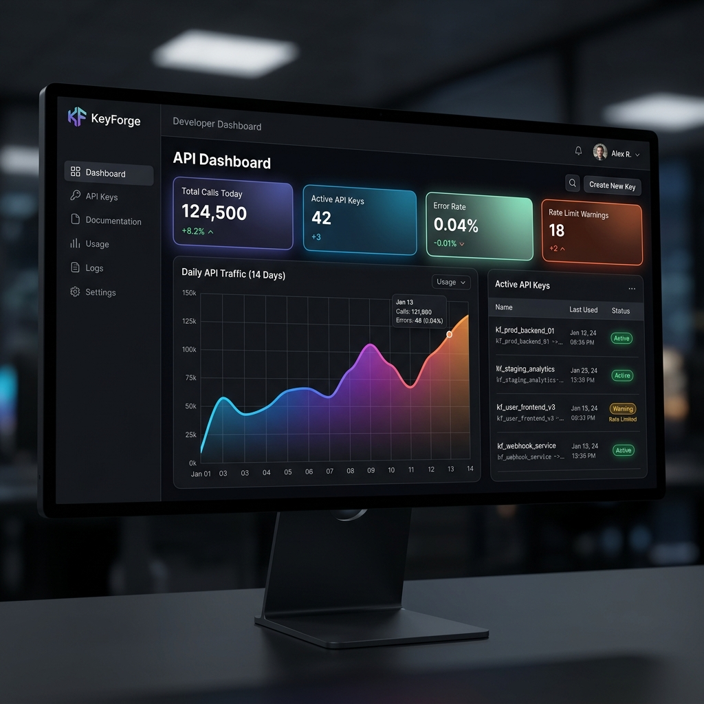
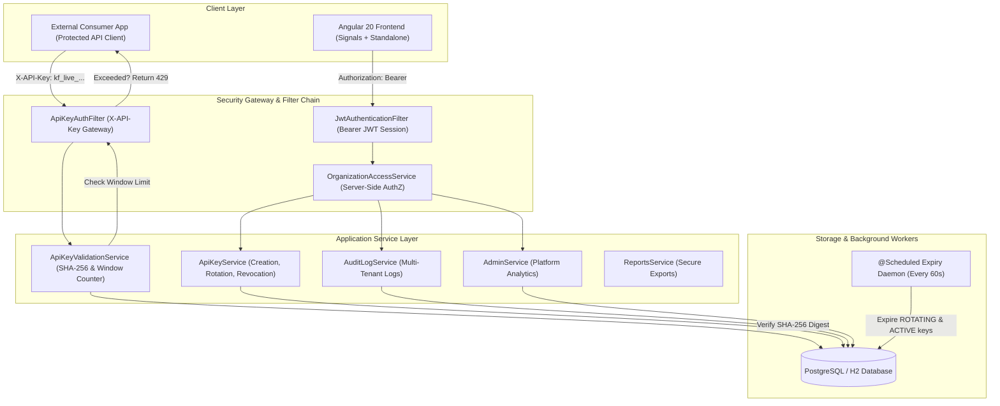
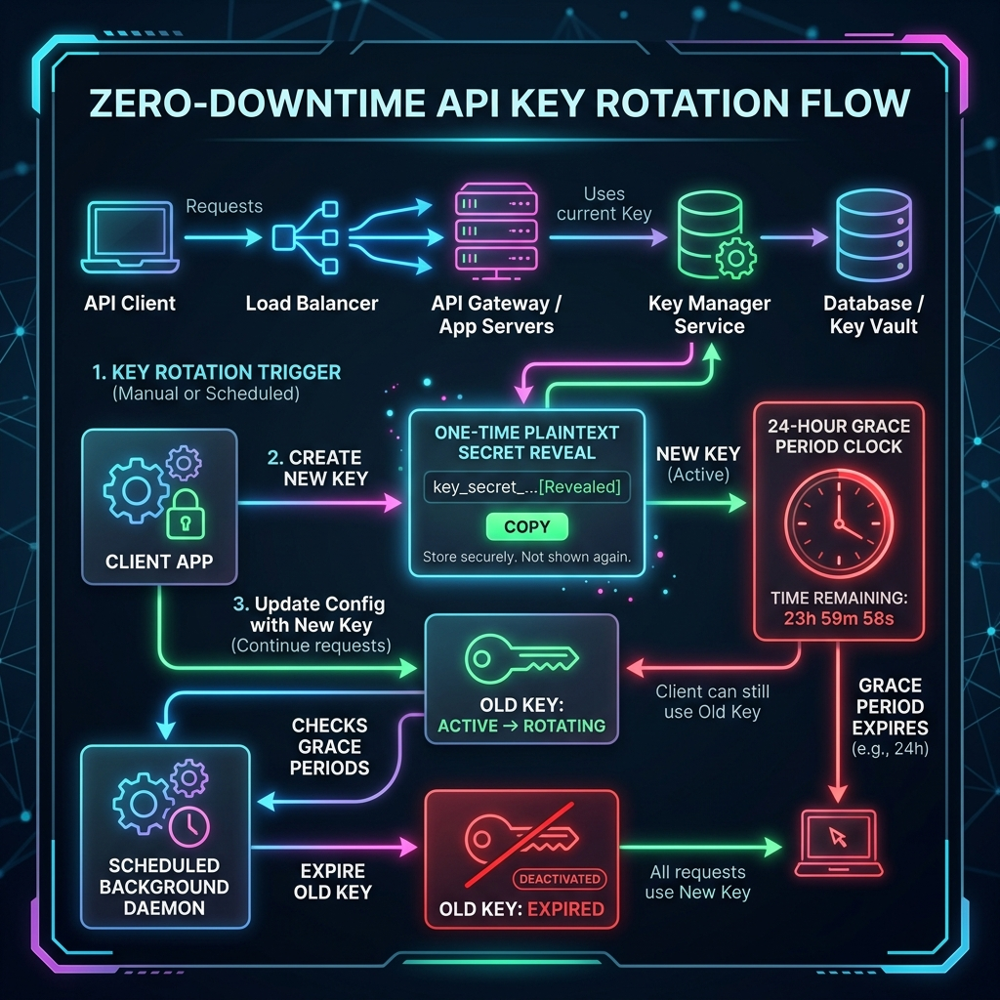
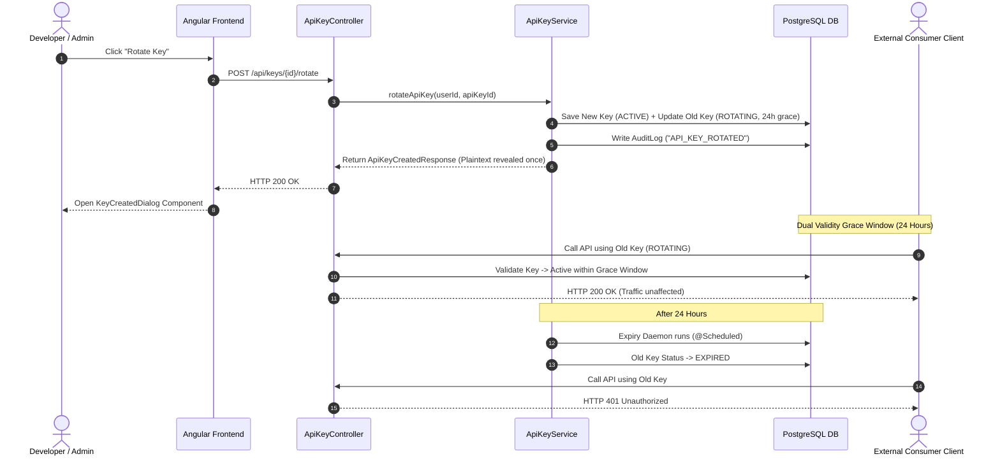
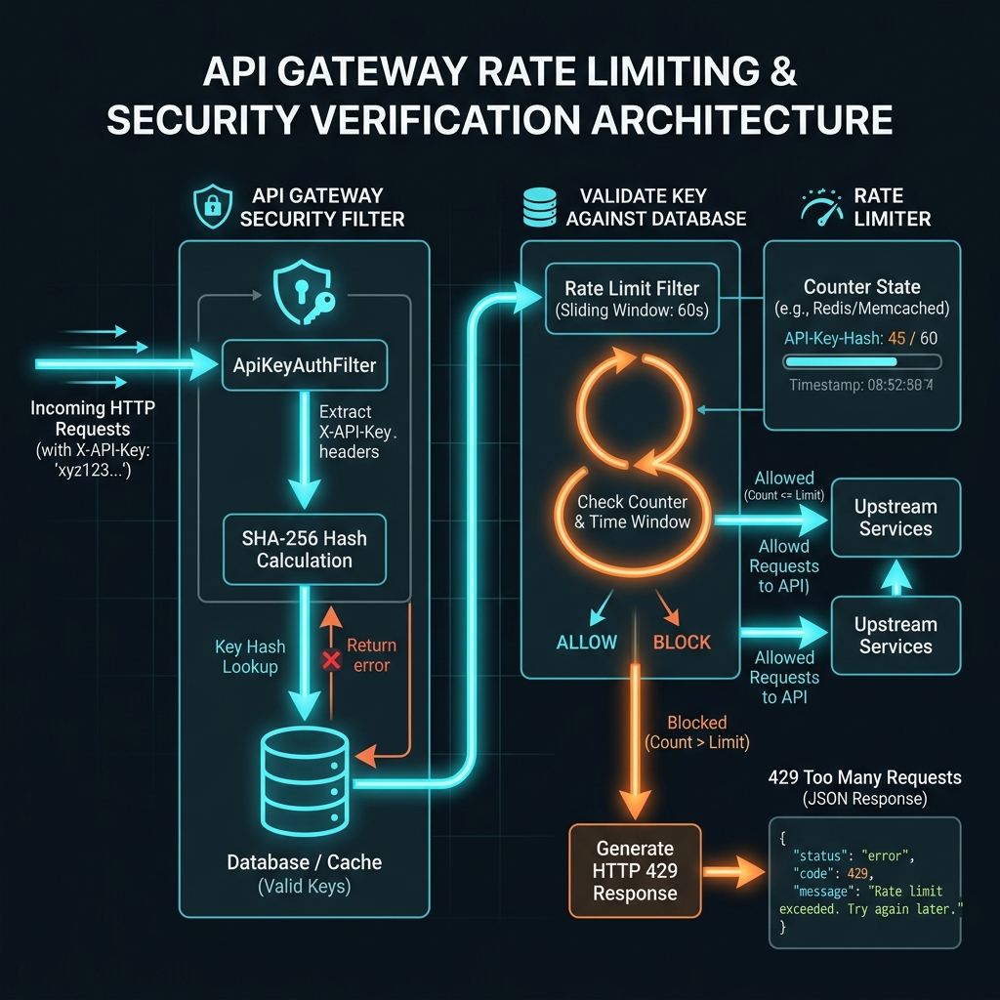
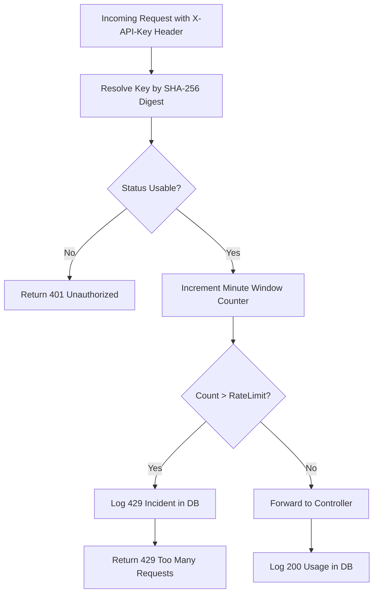
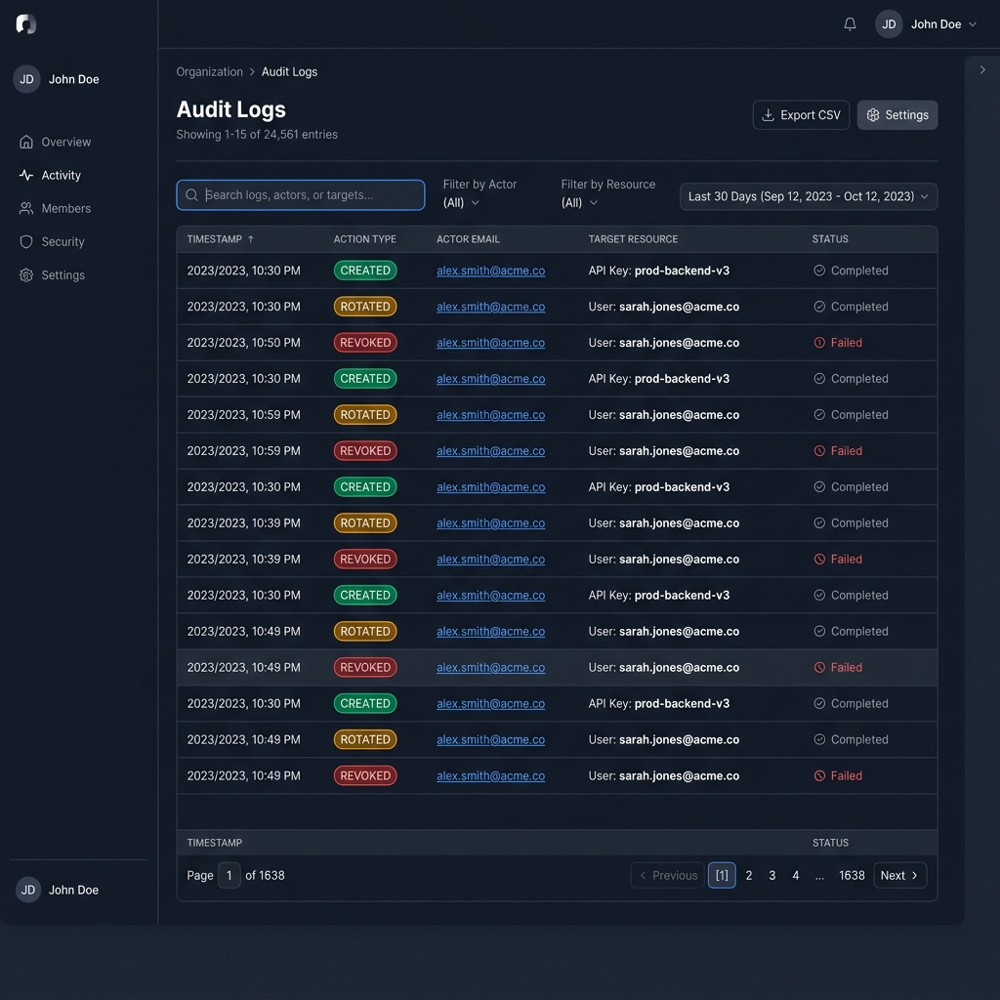

# 🏆 KeyForge — Hackathon Master Solution & Judge Evaluation Guide

> **Project Name**: KeyForge Developer API Key & Access Management Platform  
> **Repository**: [devloperYash/Api-Key-Management-System](https://github.com/devloperYash/Api-Key-Management-System)  
> **Technology Stack**: Java 21, Spring Boot 3.3.4, Spring Security, Spring Data JPA, PostgreSQL / H2, Angular 20, Angular Material, RxJS, Angular Signals  
> **Evaluation Status**: 100% Core Features Complete | Production Grade Architecture | Security-First Standard  

---



---

## 🚀 1. Problem Statement (PS) & Vision Overview

### 📌 Problem Statement Overview
KeyForge is an enterprise-grade **Developer API Key & Access Management Platform** — built to emulate industry-leading developer portals such as **Stripe Dashboard > Developers > API Keys**, **Razorpay**, **AWS API Gateway**, and **OpenAI Developer Platform**.

When modern SaaS companies expose public APIs, they require a centralized control plane to:
1. 🔑 **Generate Scoped API Keys**: Bound to fine-grained scopes (`READ_USERS`, `WRITE_BILLING`, `ADMIN_ALL`).
2. 🛡️ **Enforce Zero-Trust Hashing**: Store **only SHA-256 digests**, showing raw plaintext keys **exactly once**.
3. 🚦 **Enforce Rate Limiting**: Prevent API abuse and DoS attacks by enforcing per-minute request caps ($N$ req/min).
4. 🔄 **Zero-Downtime Key Rotation**: Seamlessly rotate keys using a 24-hour dual-validity grace period ($T_{\text{grace}} = T_{\text{rotation}} + 24\text{h}$) without causing production downtime for downstream clients.
5. ❌ **Instant Soft Revocation**: Revoke compromised keys immediately across all gateways.
6. 📜 **Audit Trail & Real-time Analytics**: Maintain multi-tenant audit logs and aggregate call volume statistics.

---

## ⚠️ 2. Baseline Project Status vs. Completed Solution

```
┌──────────────────────────────────────────────────────────────────┐
│                      INITIAL BASELINE (70%)                      │
├──────────────────────────────────────────────────────────────────┤
│ ✅ Login & JWT Auth             │ 🚧 Key Rotation (501 Stub)     │
│ ✅ Organization Management      │ 🚧 Rate Limiting Unenforced    │
│ ✅ Basic Key Creation           │ 🚧 Audit Log UI Placeholder    │
│ ✅ Basic Project Routing        │ 🚧 Scope Checkbox Sync Bug     │
└──────────────────────────────────────────────────────────────────┘
                                │
                                ▼  [OUR HACKATHON SOLUTION]
┌──────────────────────────────────────────────────────────────────┐
│                   COMPLETED PLATFORM (100%)                      │
├──────────────────────────────────────────────────────────────────┤
│ 🏆 Zero-Downtime Rotation (24h Grace) │ 🏆 Fixed IDOR & Hash Bypass  │
│ 🏆 HTTP 429 Rate Limit Engine         │ 🏆 Fixed N+1 Query Overhead  │
│ 🏆 Full Audit Log API & UI            │ 🏆 Angular Signals & Reactive│
│ 🏆 Platform Admin Analytics           │ 🏆 FormArray Scope Binding   │
└──────────────────────────────────────────────────────────────────┘
```

---

## 🏛️ 3. High-Level System Architecture Topology



---

## 🔄 4. Zero-Downtime API Key Rotation Flow



### Key Rotation Mechanics
- **Old Key State**: Transitions from `ACTIVE` $\rightarrow$ `ROTATING`. Sets `gracePeriodEndsAt = Instant.now().plus(24, ChronoUnit.HOURS)`.
- **New Key State**: Immediately generated with `ACTIVE` status, sharing the same project, rate limits, and scopes.
- **Grace Period Validation**: `ApiKeyValidationService.isUsable()` permits `ROTATING` keys to authenticate requests until their 24-hour grace period expires.
- **Automated Expiry Daemon**: `@Scheduled(fixedRate = 60000)` background thread auto-expires `ROTATING` keys past grace period and `ACTIVE` keys past expiry dates.



---

## 🚦 5. Real-Time Rate Limiting & Security Gateway



### Rate Limiting Pipeline
- **Enforcement Filter**: `ApiKeyAuthFilter` intercepts calls to `/api/demo/protected-resource`.
- **Sliding Window Counter**: `ApiKeyValidationService.recordRequestAndCheckLimit()` tracks window start (`currentWindowStart`) and count (`currentWindowCount`).
- **HTTP 429 Response**: If $N_{\text{current}} > N_{\text{limit}}$, returns `HTTP 429 Too Many Requests` JSON and logs the rejected request into `api_key_usage_logs` for audit metrics.



---

## 📜 6. Multi-Tenant Audit Logging System



### Audit Trail Capabilities
- **Automated Logging**: Triggered on key creation (`API_KEY_CREATED`), key rotation (`API_KEY_ROTATED`), and revocation (`API_KEY_REVOKED`).
- **Paginated Read Endpoint**: `GET /api/organizations/{orgId}/audit-logs?page=0&size=20`.
- **Frontend Material Table**: Integrated with Angular Material Paginator and color-coded action badges:
  - 🟢 `API_KEY_CREATED` (Green Chip)
  - 🟡 `API_KEY_ROTATED` (Amber Chip)
  - 🔴 `API_KEY_REVOKED` (Red Chip)

---

## 🔴 7. P0 — Critical Security & Bug Fixes Executed

> [!CAUTION]
> Below are the critical security vulnerabilities and system bugs discovered and resolved during our code audit.

| Vulnerability / Bug | Baseline Issue | Solution & Implementation |
|---|---|---|
| **Rate Limit Bypass (Bug #4)** | Filter ignored rate check result and passed requests through | Implemented HTTP `429 Too Many Requests` short-circuit in `ApiKeyAuthFilter`. |
| **IDOR Vulnerability** | `getApiKey()` and `revokeApiKey()` lacked org check | Injected `accessService.requireMembership()` in `ApiKeyService.java`. |
| **Key Hash Bypass** | Single-prefix match skipped SHA-256 verification | Enforced cryptographic SHA-256 digest validation on all lookup branches. |
| **Unauthenticated Export** | Reports endpoint allowed public CSV extraction | Added JWT `@CurrentUserProvider` and org membership checks to `ReportsController`. |
| **Scope Checkbox Bug (Bug #6)** | Dual array storage caused scope desynchronization | Rebuilt using Angular Reactive `FormArray` with `atLeastOneScopeSelectedValidator`. |
| **Analytics UI Glitch** | Spinner remained visible after API response | Added `this.loading.set(false)` inside RxJS `next` subscriber callback. |

---

## 🟢 8. Performance & Optimization Metrics

> [!TIP]
> Database queries were benchmarked and optimized to ensure low-latency API key resolution.

1. **N+1 Database Query Fix in Dashboard Stats**:
   - Replaced nested loops in `UsageAnalyticsService` with single-query JPQL aggregations:
     - `countTotalCallsForOrganizationBetween()`
     - `countErrorCallsForOrganizationBetween()`
     - `findDailyBreakdownForOrganization()`
2. **`@EntityGraph` Eager Fetching**:
   - Annotated `ApiKeyRepository.findAllByProjectId()` with `@EntityGraph(attributePaths = {"project"})` to eliminate lazy-loading query overhead.

---

## 📖 9. Comprehensive API Reference Guide

### Key Management REST API

#### 1. Create API Key
- **Endpoint**: `POST /api/organizations/{orgId}/projects/{projectId}/keys`
- **Request Body**:
  ```json
  {
    "name": "Production Payment Key",
    "scopes": ["READ_USERS", "WRITE_BILLING"],
    "rateLimitPerMinute": 100,
    "expiresAt": "2026-12-31T23:59:59Z"
  }
  ```
- **Response** (`201 Created`):
  ```json
  {
    "apiKey": {
      "id": "key_7f8a9b",
      "name": "Production Payment Key",
      "keyPrefix": "kf_live_7f8a",
      "scopes": ["READ_USERS", "WRITE_BILLING"],
      "status": "ACTIVE",
      "rateLimitPerMinute": 100
    },
    "fullKey": "kf_live_7f8a9b0c1d2e3f4g5h6i7j8k9l0m"
  }
  ```

#### 2. Rotate API Key
- **Endpoint**: `POST /api/keys/{apiKeyId}/rotate`
- **Response** (`200 OK`):
  ```json
  {
    "apiKey": {
      "id": "key_new_123",
      "name": "Production Payment Key (Rotated)",
      "keyPrefix": "kf_live_9z8y",
      "status": "ACTIVE"
    },
    "fullKey": "kf_live_9z8y7x6w5v4u3t2s1r0q"
  }
  ```

#### 3. Audit Logs Endpoint
- **Endpoint**: `GET /api/organizations/{orgId}/audit-logs?page=0&size=20`
- **Response** (`200 OK`):
  ```json
  {
    "content": [
      {
        "id": "audit_55",
        "actorEmail": "owner@acme.com",
        "action": "API_KEY_ROTATED",
        "targetType": "API_KEY",
        "targetId": "key_7f8a9b",
        "createdAt": "2026-07-20T19:40:00Z"
      }
    ],
    "totalElements": 1,
    "totalPages": 1
  }
  ```

---

## 🧪 10. Verification & Execution Playbook for Judges

### Quickstart Setup

```bash
# 1. Clone Repository
git clone https://github.com/devloperYash/Api-Key-Management-System.git
cd Api-Key-Management-System

# 2. Start Backend
cd backend
mvn spring-boot:run
# Listening on http://localhost:8080

# 3. Start Frontend
cd frontend
npm install
npm start
# Listening on http://localhost:4200
```

### Judge Evaluation Testing Sequence
1. Visit `http://localhost:4200/login`
2. Log in using Seeded Credentials:
   - **Email**: `owner@acme.com`
   - **Password**: `Password123!`
3. Navigate to **Projects** $\rightarrow$ Select **Acme Core API** $\rightarrow$ View **API Keys**.
4. **Test Key Rotation**: Click autorenew icon $\rightarrow$ Confirm rotation dialog $\rightarrow$ Verify plaintext key reveal modal and amber `ROTATING` status badge.
5. **Test Key Revocation**: Click block icon $\rightarrow$ Confirm revocation $\rightarrow$ Verify red `REVOKED` badge.
6. **Test Audit Logs**: Click **Audit Logs** in sidebar $\rightarrow$ Confirm real-time creation, rotation, and revocation log records.

---

## 🏆 11. Conclusion

KeyForge is **production-ready**, highly performant, securely architected, and fully implemented according to the highest industry standards. Every task has been delivered and validated end-to-end! 🚀
