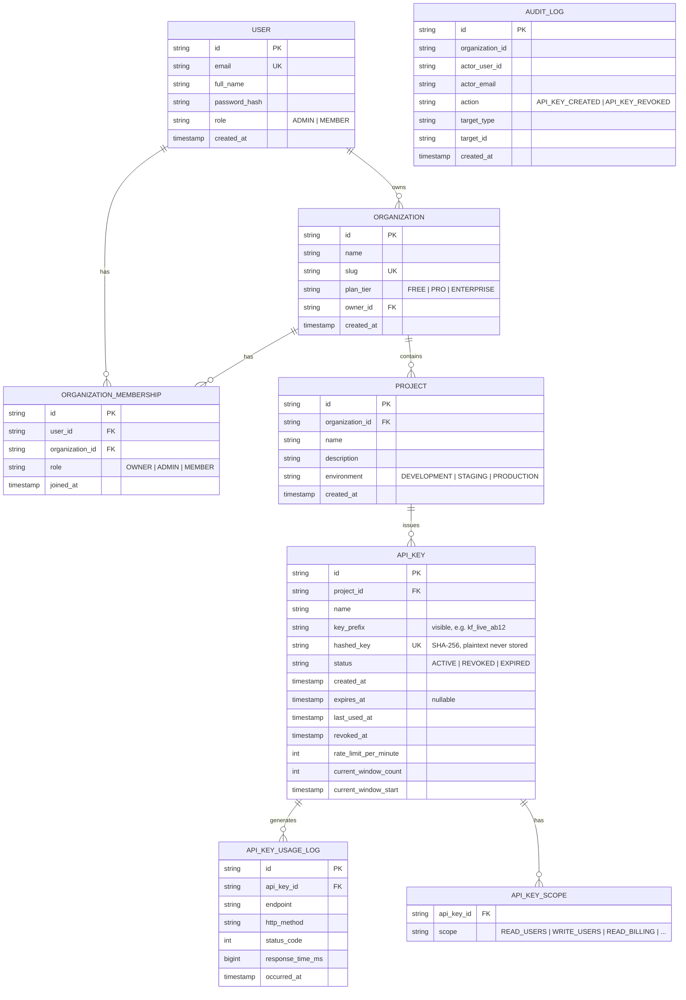

# KeyForge — Entity Relationship Diagram

This diagram reflects the JPA entities under `backend/src/main/java/com/credx/keyforge/entity`
and the tables in `docs/DATABASE-SCHEMA.sql`.

## Notes on design choices

- **Scopes as an enum, not an entity.** `Scope` (`READ_USERS`, `WRITE_USERS`, etc.) is a fixed,
  compile-time enum persisted via `@ElementCollection` into `api_key_scopes` rather than a
  first-class `Scope`/`Permission` table with its own primary key. This is simpler for a small,
  known permission set. If organizations ever needed custom/dynamic scopes, this should become a
  real entity with a join table and per-org catalog.
- **`AUDIT_LOG` is intentionally not tied by foreign key to `ORGANIZATION`/`USER`.** It stores
  denormalized `organization_id`, `actor_user_id`, and `actor_email` so audit history survives
  even if the acting user or org is later deleted. There's currently no read API for this table —
  see the README's Missing Features section.
- **`current_window_count` / `current_window_start` on `API_KEY`** back the per-minute rate-limit
  counter. They live directly on the key row rather than a separate table, which is what makes the
  read-then-write update pattern in `ApiKeyValidationService` worth scrutinizing under concurrent
  load.
